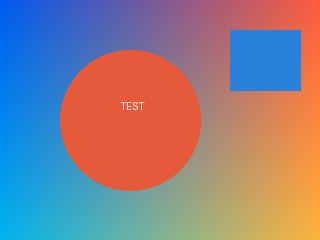
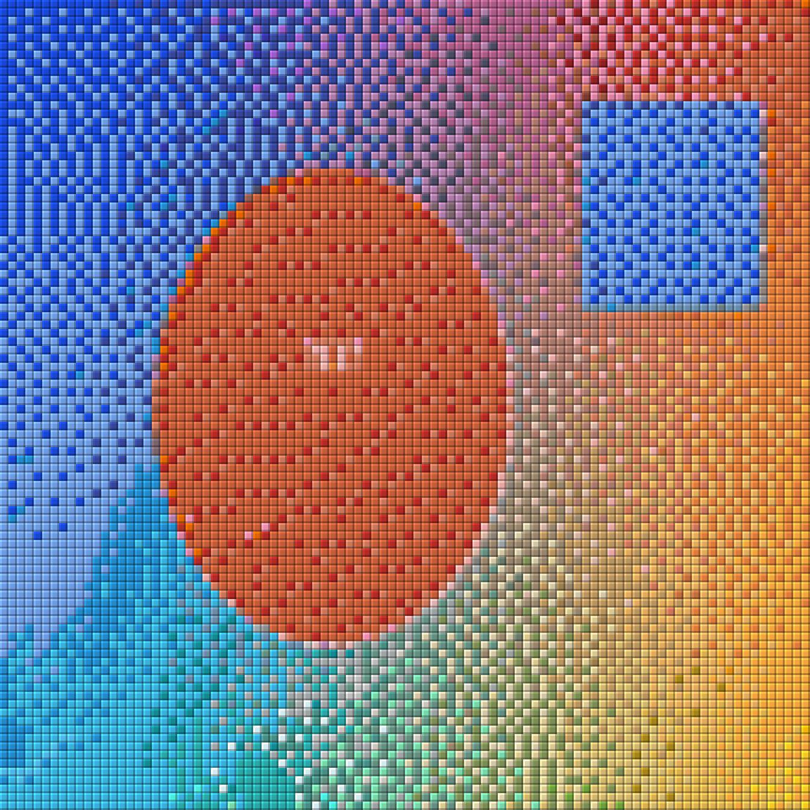

# Image → Pixel Art → Minecraft Projection Generator

[](https://github.com/XueDric/image-to-mc-pixelart/actions/workflows/ci.yml)
[](LICENSE)

> 一条流水线把**任意图片**变成 **Minecraft 建筑投影（`.litematic`）**。
> 简体中文文档见 [docs/使用说明.md](docs/使用说明.md)。

A two-stage pipeline that turns any image into a **Litematica building schematic** you can load in Minecraft:

1. **Stage 1 — Pixel art.** Resize an image to a target grid (`16×16` → `4096×4096`, or custom `W×H`, optional keep-aspect-ratio). **1 pixel = 1 cell**, and the **original colors are preserved with no palette limit**. Optional background removal / carve-out.
2. **Stage 2 — Minecraft projection.** Match each cell to the nearest Minecraft block color and export a **`.litematic`** schematic + a **blockified preview PNG** + a **material list** (Excel with Chinese block names, or CSV).

## Screenshots

| Input | Output (blockified projection) |
| --- | --- |
|  |  |

*Generated with `python cli.py 示例/示例照片.png --size 96`.*

## Features

- **Any image in, `.litematic` out** — PNG / JPG / BMP / GIF / WebP.
- **No color limit in stage 1** — every pixel is kept; photo gradients are reproduced in stage 2 by matching against a 149-block MC palette + **Floyd–Steinberg dithering** (or plain nearest color).
- **Perceptual color matching** — CIE **Lab** distance by default (human-eye-ish), or literal RGB (`--color-space rgb`).
- **Selectable MC palettes** — `wool` / `concrete` / `terracotta` / `glass` / `misc` / merged sets (`auto`/`wool+concrete`/`concrete+terracotta`).
- **Background handling** — none / `trim` (carve-out, transparent pixels become air) / `glass` (white or sampled background becomes a glass pane, subject stays solid).
- **2D wall art or 3D relief** — `--thickness` for depth, `--backing` for the back fill, `--scale` to enlarge each pixel to N×N blocks, plus `--orientation wall|floor`.
- **Glass consistency (double protection)** — a matching threshold plus connected-component denoising so glass only appears in large regions, avoiding speckle.
- **Material list** — sorted Excel with Chinese block names, counts and color swatches (openpyxl), CSV fallback.
- **Fast** — numpy-vectorized color matching handles million-pixel images in seconds.
- **Auto-excludes unstable blocks** — ice (melts), snow layers, soul sand, bedrock, slime/honey (see `mc_palette.py`).

> **Why does pure red become orange?** The default CIE Lab distance judges `#FF0000` perceptually closer to orange wool. Use `--color-space rgb` for a literal nearest-color.

## Quick start

### Requirements
- Python 3.9+ (3.10+ recommended), Windows / Linux / macOS (GUI uses Tkinter).
- `pip install -r requirements.txt`

### GUI
```bash
python main.py
```

Pick an image → choose stage-1 size / background → **① Generate pixel art** → set stage-2 options → **② Generate MC projection**, or just **Generate all**.

### Command line
```bash
python cli.py 我的照片.png                            # default 48×48
python cli.py 我的照片.png --size 64                   # 64×64
python cli.py 我的照片.png --size 128 --keep-aspect    # keep aspect ratio
python cli.py 我的照片.png --size 96 --mc-palette concrete --dither none
python cli.py 我的照片.png --size 64 --trim            # remove white background (carve-out)
python cli.py 我的照片.png --size 64 --bg-glass        # white bg -> glass, subject stays solid
python cli.py 我的照片.png --size 64 --bg-glass --bg-color 0188D3
python cli.py 我的照片.png --size 64 --scale 2 --thickness 2 --backing white_concrete
python cli.py 我的照片.png --size 64 --orientation floor
python cli.py 我的照片.png --size 128 --export-pixel-art
python cli.py 图1.png 图2.png 图3.png                  # batch convert
```

> Full options: `python cli.py --help`.

### Output files (next to the image by default)
| File | Contents |
| --- | --- |
| `{name}.litematic` | Litematica **building projection** (load in-game) |
| `{name}.preview.png` | **Blockified preview** image |
| `{name}.stats.xlsx` | **Material list** (Excel: Chinese name / count / color swatch) |
| `{name}_像素画.png` | Pure 1px-per-cell pixel art (with `--export-pixel-art`) |

## Use the projection in Minecraft

1. Put the `.litematic` into your `schematics` folder:
   - Fabric/Litematica: `%APPDATA%\.minecraft\schematics\`
2. In-game, open the **Litematica** menu (`M`) → **Load Schematic**.
3. Place / move it, then build manually — or print it automatically with **litematica-printer**.

> Default `--mc-data-version 3955` (MC 1.21.1). For 1.21.4 use `--mc-data-version 4085`.

## Compatibility

Generated `.litematic` files are **Version 7 / SubVersion 1**, LSB-first `BlockStates`, with `bits = max(2, ceil(log2(palette)))` 64-bit packing and index `index = y*(W*Z) + z*W + x`.

Cross-validated against **litemapy** (independent implementation) block-by-block **and** by an internal NBT reader round-trip (see `测试/test_pipeline.py`).

## Project structure

```
图片转MC像素画投影/
├── main.py               # GUI (Tkinter) entry point
├── cli.py                # Command-line entry point
├── pipeline.py           # Two-stage core (shared by GUI & CLI)
├── mc_palette.py         # MC block colors + matching
├── litematic_writer.py   # .litematic v7 NBT writer
├── pixelart2litematic.py # Pixel art -> blocks -> schematic / preview
├── mc_names.py           # Chinese block names for the material list
├── pyproject.toml        # Metadata + deps + pytest/ruff config (`pip install .`)
├── build.spec            # Reproducible PyInstaller build (one command -> 2 exes)
├── requirements.txt      # Runtime deps
├── requirements-dev.txt  # Dev/test deps (pytest, litemapy)
├── LICENSE               # MIT
├── examples/ ... 示例/       # Sample input + preview
├── docs/使用说明.md         # Full Chinese manual
├── .github/workflows/ci.yml # CI: pytest on Ubuntu + Windows
└── 测试/                 # Tests (litemapy cross-check + NBT round-trip)
```

## Development

```bash
pip install -r requirements-dev.txt   # adds pytest + litemapy (for tests)
pytest 测试/                          # run the integration / validation suite
python main.py --self-test <dir>      # headless self-test (also used for packaged builds)
```

CI runs `pytest 测试/` on **Ubuntu** and **Windows** for every push / pull request (see `.github/workflows/ci.yml`).

## License

[MIT](LICENSE)
